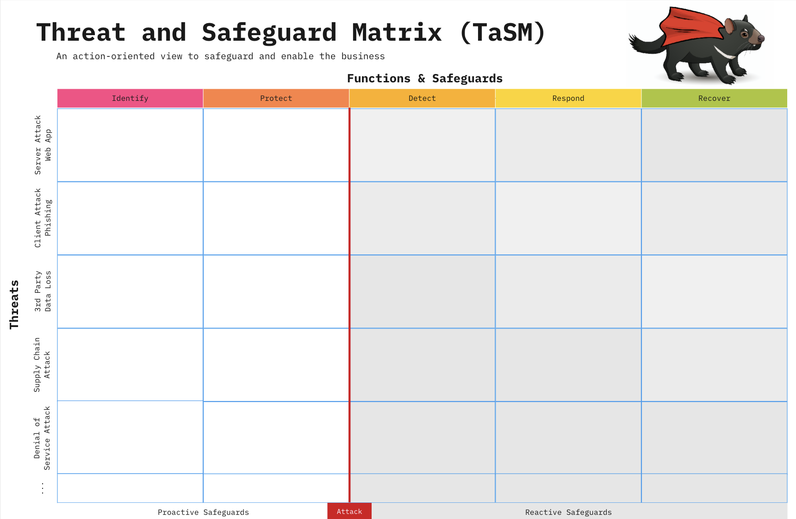
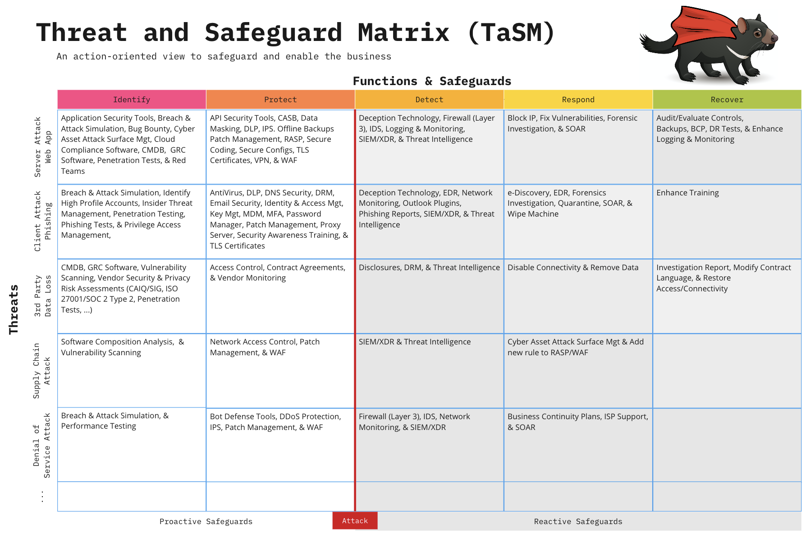
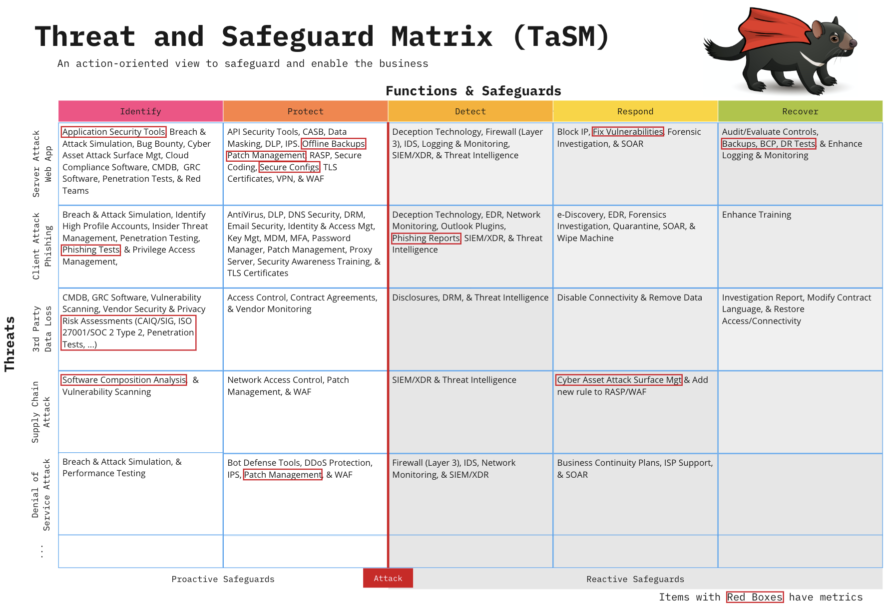
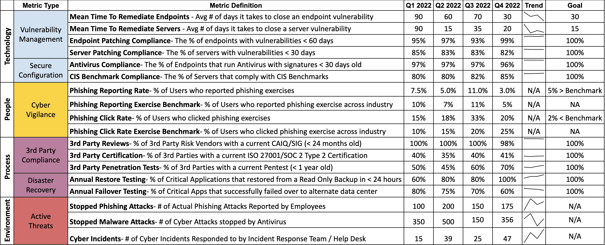
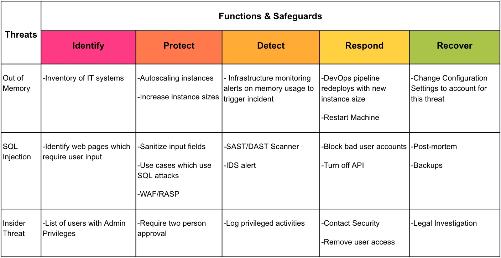
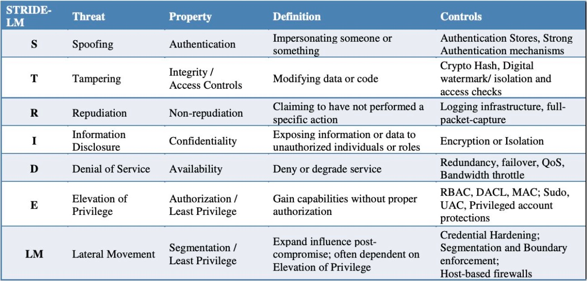
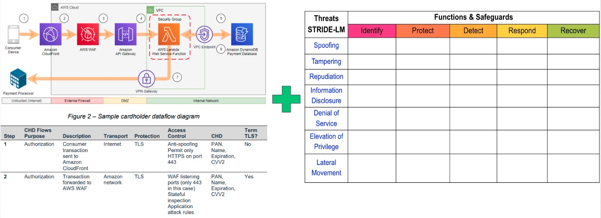
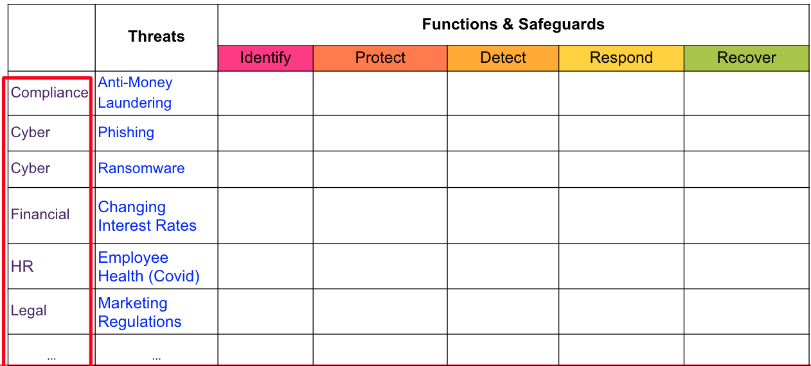
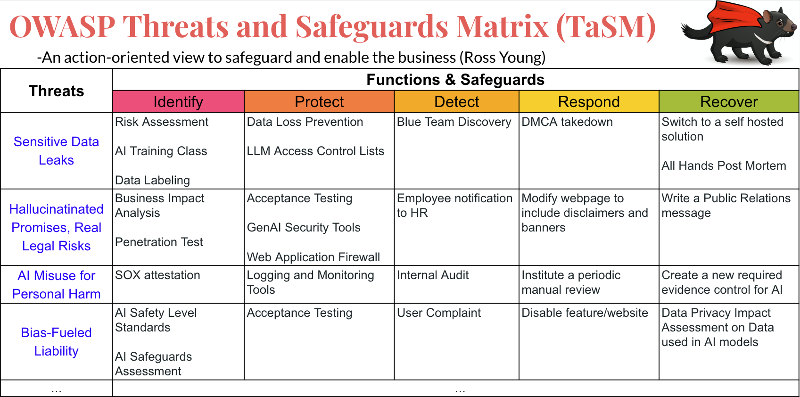

---

layout: col-sidebar
title: OWASP 脅威とセーフガードのマトリクス (Threat and Safeguard Matrix, TaSM)
tags: TaSM
level: 2
type: documentation

---
この著作物は <a rel="license" href="http://creativecommons.org/licenses/by-sa/4.0/">Creative Commons Attribution-ShareAlike 4.0 International License</a> の下でライセンスされています。

# はじめに
脅威とセーフガードのマトリクス (Threat and Safeguard Matrix, TaSM) は [CISO Tradecraft](https://www.cisotradecraft.com/) によって作成された、ビジネスを保護し実現するための行動指向のビューです。簡単に言うと、サイバーが収益保護のビジネスに携わっているのであれば、私たちは企業に対する最大の脅威に対抗するための多層防御計画を立てる必要があります。このマトリクスによって、企業は主要な脅威を NIST のサイバーセキュリティフレームワーク機能 (Cyber Security Framework Functions) (識別 (Identify), 防御 (Protect), 検知 (Detect), 対応 (Respond), 復旧 (Recover)) と重ね合わせて、堅牢なセキュリティ計画を構築できます。この活動を行う組織は重要な脅威を軽減するセーフガードを記入することで自社を保護する方法をよりよく理解できるようになります。悪魔 (devil) は細部に宿るということで、私たちはタスマニアデビル (TaSManian Devil) をプロジェクトのロゴに選びました。

例: 情報セキュリティ業界全体を見渡すと、企業に対する最大の脅威には次のようなものが多いことに気づくでしょう。ウェブアプリケーション攻撃、フィッシング、サードパーティデータ損失、サプライチェーン攻撃、サービス拒否などです。このマトリクスにはインサイダー脅威、ユーザーエラー、不正行為など、あなたの環境に特有のものを追加できることをご承知ください。

ここでは企業に対するこれらの脅威を軽減するための多層防御計画を構築する方法の一つを紹介します。

# 脅威の一般的な例
重大な損失を引き起こす可能性のある脅威の一般的な例を探している場合は、以下のいずれかのシナリオを使用することを検討してください。
1. **ブランドなりすまし詐欺** – 詐欺師が偽のウェブサイトを立ち上げて、あなたの名前で偽造品を販売します。
2. **ビジネスメール詐欺** – 従業員がフィッシング詐欺に引っかかり、ユーザー名、パスワード、さらには MFA コードまで渡してしまいます。
3. **ビジネスロジックバグ** – 取引アルゴリズムのバグにより利益より損失が発生します。
4. **BYOD 問題** – リモートの従業員が仕事を外注し、知らないうちに北朝鮮の無許可の外国人アクターが関与してしまいます。
5. **CEO のなりすまし** – 詐欺師がソーシャルメディア上でディープフェイクを用いて CEO になりすまし、レイオフや財政難の噂を流して株価を暴落させます。CEO はソーシャルメディアを持ってすらいないことに注意してください。
6. **クラウドの中断** – クラウドプロバイダや SaaS パートナーがダウンすると、ビジネスの継続性も失われます。
7. **コンプライアンス証明の複雑さ** – 規制の解釈を誤ると、虚偽の証明につながり、法的措置を受ける可能性があります。
8. **クレデンシャルの盗難問題** – オープンソースプロジェクトで機密性の高いサーバーやクラウド環境へのシークレットトークンや秘密鍵を誤って公開してしまいます。
9. **顧客報酬の強奪** – デジタル泥棒が顧客報酬ポイントを奪い、サポートチームにお怒りの電話が殺到します。
10. **電子メール過多** – リーダーは使い捨ての Gmail アカウントからの終わりのないスパムに溺れています。
11. **ディープフェイク詐欺** – CFO の超リアルなディープフェイクが買掛金チームを騙して不正送金させます。
12. **DDoS/ボットネット攻撃** – 物議を醸す企業声明の後、ボットの大群がウェブサイトをダウンします。
13. **フォーラムの汚損** – スクリプトキディが顧客ヘルプフォーラムをジャンクコンテンツであふれさせ、あなたのブランドの信頼性を台無しにします。
14. **ヘルプデスクハイジャック** – なりすまし犯が IT サポートを巧みに言いくるめて従業員のパスワードをリセットさせます。
15. **内部関係者の脅威** – 離職する研究者が機密 IP をライバル会社に持ち出します。
16. **感染した IoT デバイス** – マルウェアがパッチ未適用の IoT デバイスを乗っ取り、サイバーゾンビに変えてしまいます。
17. **オープンソースのトロイの木馬** – 開発者がインストールした「役に立つ」ライブラリ？それにはマルウェアと暗号マイナーがプリロードされていました。
18. **長期の停電** – 自然災害により電力が供給されなくなり、業務が停止してしまいます。
19. **ハードウェアの悪用** – 国家レベルの攻撃者がネットワーク機器にインプラントを仕込みます。
20. **支払い詐欺** – 詐欺師はあなたの顧客を騙して支払いを詐欺口座に振り向けます。
21. **プライベートデータの公開** – S3 バケットの設定ミスから機密データが漏洩します。これであなたのシークレットが漏れてしまいます。
22. **不正アクセスポイント** – 社員食堂近くにある不正なネットワークが企業 Wi-Fi を模倣して、無警戒な従業員を誘い込みます。
23. **不適切なアクセス権限** – 機密性の高い SharePoint データが悪質なリセラーの手に渡り、何年にもわたって使用されてしまいます。
24. **パッチ未適用のラップトップ** – 従業員が空港の Wi-Fi に接続し、知らないうちにパッチ未適用のラップトップにマルウェアを侵入されてしまいます。
25. **ゼロデイ攻撃** – ハッカーはパッチが存在する前に、あなたの公開ウェブサイトで新しい OpenSSL/Log4J 脆弱性を悪用します。

* NIST から脅威イベントの詳細なリストを探している場合は、[NIST Special Publications 800-30 Appendix E-1](https://nvlpubs.nist.gov/nistpubs/Legacy/SP/nistspecialpublication800-30r1.pdf) の使用を検討してください。

# 計画に評価指標 (Metrics) を加える
TaSM を構築したところで、リストアップしたセーフガードとどこにギャップがあるのかに目を向けることが重要です。すべてのセーフガードが重要というわけではありません。すべてが重要であるならば、真に重要なものは何もありません。組織として重視したいセーフガードについて考えてみてください。これらは脅威を阻止するために最も効果的なものである可能性があります。また、これらのセーフガードには最も改善の余地がある可能性もあります。重要な評価指標を設定できるセーフガードをいくつか選び、赤枠で囲んで強調します。こうすることで評価指標から TaSM への進行状況をマッピングできます。測定されたものが実行され、実行されたものが資金を得る (What gets measured gets done and what gets done gets funded) ことを忘れないでください。

# サイバーレポートカードを作成する
組織が改善したいセーフガードの概略を記載した後、重要な評価指標を作成してスコアカードに配置する必要があります。この例ではいくつか注意すべき点がありますが、自由に変更してください。物事をテクノロジ (Technology)、人 (People)、プロセス (Processes)、環境 (Environment) など主要なカテゴリにグループ化します。環境 (Environment) とは組織がコントロールできないもの (悪意のある人物や外部の規制当局など) を指すことに注意してください。

スコアカードは監視、測定、分析が可能な評価指標に分解されます。これらは組織内で実施されている情報セキュリティ活動の成果を測定するための重要業績評価指標 (Key Performance Indicator, KPI) と考えることができます。優れた評価指標には 4 ～ 5 の重要事項が示されることを忘れないでください。
1. 明確な <b>定義 (Definition)</b>: 評価指標が意味するのは何か
2. <b>状況 (Status)</b>: 評価指標が過去の時点および現在どこにあるか
3. <b>傾向線 (Trend Line)</b>: 現在の状況が改善しているのか、停滞しているのか、悪化しているのかを簡単にハイライトする
4. <b>目標 (Goal)</b>: 組織が達成すべき「完了した状態」や「望ましい状態」を明確に定義して示す
5. (オプション) <b>期限 (Due Date)</b>: 将来的に目標をいつまでに達成するか。すでに目標を達成しており、今後コンプライアンスを維持するだけでよい評価指標があるかもしれないので、これはオプションであることに注意してください。

最後に、スコアカードを使って経営陣と共有できるストーリーを作りましょう。このストーリーは架空のものであり、実際の企業を反映したものではないことをご理解ください。

<b>例:</b> このスコアカードは XYZ 組織のリスクプロファイルを識別しました。ご覧の通り、99% のサーバーが 20 日以内に重大な脆弱性にパッチを適用していることがわかります。これらの脆弱性の数値は私たちが期待する 15 日間という目標には達していませんが、ウェブアプリケーションファイアウォール、プロキシサーバー、アンチウィルスなどのツールも導入しており、これらのセーフガードはパッチをすぐに適用できない隙間時間に対してさらなる保護を提供します。現在、パッチ適用プログラムには満足していますが、これが最も不安定な評価指標の一つであることも認識しています。また、毎年行われるフェールオーバーでは、ソフトウェアチームのわずか 60% しか成功しませんでした。つまり、プライマリデータセンタでハリケーンによる停電などの大規模な災害が発生した場合、当社の SOX アプリケーションの 40% が利用できないことになります。この評価指標を改善するために XYZ アクションを実行します。ご存じのように、私たちはランサムウェアの防御を非常に重視しています。そのため、重要なアプリケーションの 100% で復旧テストが成功したことを示すことができ、非常にうれしく思っています。これは、ランサムウェアの攻撃者が当社のサーバーを暗号化できたとしても、身代金を支払うことなく復旧できる自信があることを意味します。今後は XYZ に注力して ...

# TaSM を使用して脅威モデリングを強化する
組織で TaSM を適用する方法をさらに検討する中で、方法の一つとしてアプリケーション脅威モデリングのディスカッションの中で TaSM を活用できるかもしれません。アプリケーションチームが示す脅威モデルは以下のようなものです。

アプリケーション開発チームは STRIDE-LM モデルのような実績のある脅威モデルを使用して脅威のカテゴリを標準化し、アプリケーションに共通する脅威を特定できます。

アプリケーションチームは STRIDE-LM で拡張した TaSM を [データフロー図](https://d1.awsstatic.com/whitepapers/compliance/pci-dss-compliance-on-aws.pdf?did=wp_card&trk=wp_card) と組み合わせることもできます。データフロー図は (暗号化層、アクセス制御方法、データタイプなどの) 主要な属性を示すネットワーク図であることに注意してください。

STRIDE-LM で拡張した TaSM とデータフロー図の両方を使用することで、アプリケーションチームはアーキテクチャレビューボードの際に、アプリケーションと気づいた脅威をシンプルかつ効果的な方法で説明できます。これで洞察に満ちたディスカッションを行うことができます。さらに、アーキテクチャレビューボードはすべてのアプリケーションの 20% が同じ所見を持っていることに気づくかもしれません。これらの所見はエンタープライズソリューションで解決するために IT リーダーに伝えることができます。
 

# TaSM を使用してリスク委員会の改善に役立てる
脅威の種類はサイバー脅威だけではないため、TaSM をより広く使用するためにどのように採用できるかについてもリスク委員会で検討する必要があります。必要なのは企業内の組織をリストアップする列を追加することだけです。各組織が上位 3 ～ 5 の脅威を共有していると想像してみてください。リスク委員会は会社が最大の脅威をどのように軽減しているかを <b>一貫性があり (Consistent), 適切で (Adequate), 合理的で (Reasonable), 効果的な (Effective) (CARE)</b> 方法で示すことができます。さらに、委員会がパートナーと協力して、さまざまな角度から脅威を解決できます。例: ブランドに損害を引き起こすフィッシング攻撃への対応を支援するには、サイバー (Cyber) は人事 (HR) や法務 (Legal) のプロセスをどのように活用できるでしょうか？

# TaSM を使用して AI 関連の脅威から保護する
人工知能 (Artificial Intelligence, AI) などの新たな脅威に対しても TaSM を使用することを忘れないでください。これは最先端の脅威に対する効果的な戦略がどのようなものかを示す素晴らしい方法です。これは AI における新たな脅威を阻止するための効果的なプログラムを作成するために必要なソリューションの範囲を予測する必要がある場合に非常に役立ちます。

たとえば、あなたの会社が生成 AI や大規模言語モデル (Large Language Model, LLM) の使用に関して懸念している 7 つの重大な脅威があるとしましょう。
1. **機密データの漏洩**: 従業員が機密情報や知的財産を許可されていない外部の LLM にアップロードします。
2. **悪意のある AI サプライチェーン**: 開発者がマルウェアや隠れた暗号通貨マイナーに汚染された AI/ML モデルを統合します。
3. **虚偽の約束、現実の法的リスク**: チャットボットは会社が実現できない成果を誤って約束し、法的責任を問われることになります。
4. **データの過剰露出**: 制限のない企業調査について LLM をトレーニングすることで、内部関係者がロールベースのアクセス制御をバイパスして、機密データにアクセスできるようになります。
5. **個人的な危害を目的とした AI の悪用**: 従業員が LLM の機能を悪用して、元配偶者へのストーカー行為や嫌がらせを行います。
6. **非倫理的な AI 推奨**: 言語モデルが、経済的負担を軽減するために安楽死を提案するなど、道徳的に問題のある決定を下します。
7. **偏見に起因する責任**: 性別、人種、年齢などのデータフィールドで学習された融資審査 AI は法的リスクと風評リスクを生み出します。

ビジネスに最も関連する 7 つの AI 脅威のうち上位 4 つからあなたの組織を保護する方法を示す TaSM を作成することを検討してください。たとえば以下のようなものです。

このマトリクスから、会社が AI セキュリティを解決するために購入できる単一のソリューションは存在しないことが明らかになります。それぞれの脅威には独自のセーフガードを必要とし、多様な AI リスクに効果的に対処し、会社を重大な影響から保護するためには、堅牢な多層防御戦略の必要性を強調しています。

# 用語の意味は？
TaSM を適切に使用するには、マトリクス内で使用されている用語の定義を必ず理解してください。

### サイバーセキュリティ (Cyber Security)
サイバーセキュリティは収益保護のビジネスです。サイバーセキュリティとは重要なデータが漏洩 (機密性) 、改竄 (完全性) 、拒否 (可用性) されるリスクを理解し、管理し、軽減することに関するすべてです。

### 脅威 (Threats)
国家安全保障システム委員会 (Committee on National Security Systems, CNSS) は **[脅威 (Threat)](https://www.cnss.gov/CNSS/openDoc.cfm?RdlzQ4+p2Zr6FLhO4Lo3Bw==)** を組織の運営に悪影響を及ぼす可能性のあるあらゆる事象と定義しています。

### NIST 機能 (Functions)
NIST サイバーセキュリティフレームワークの 5 つの機能 (Functions) により、どのようにビジネスを保護するかを識別する多層防御戦略を作成できます。

**1) 識別 (Identify)**
識別機能はシステム、人、資産、データ、機能に対するリスク管理の組織的理解を深めるのに役立ちます。主な目的: この種の脅威に脆弱なすべての人、プロセス、システムを識別する。

**2) 防御 (Protect)**
保護機能は脅威の影響を制限したり、封じ込めたりする機能をサポートします。主な目的: 脆弱性を除去またはブロックすることで、どのように攻撃の脅威を制限できるか。

**3) 検知 (Detect)**
検知機能は事象の発生を適時に識別するための活動を定義するものです。主な目的: (防御フェーズで) 脅威を止めることができなかった場合に、それが発生していることおよび会社に被害が及んでいることをどのようにして知ることができるか。

**4) 対応 (Respond)**
対応機能には影響を最小限に抑えるためのインシデントに関する適切な活動があります。主な目的: 脅威が顕在化した際に、さらなる金銭的被害、風評被害、コンプライアンス違反、プライバシー侵害をどのように防止するか。

**5) 復旧 (Recover)**
復旧機能には耐性のための計画を維持し、サイバーセキュリティインシデントの際に障害のあるサービスを復帰させるための適切な活動を識別することがあります。主な目標: インシデント発生前と同等またはそれ以上の状態にどのようにして到達するか

### セーフガード (Safeguards)
**セーフガード (Safeguards)** とは情報システムの脆弱性を軽減する行動、装置、手順、技法、またはその他の手段です。セキュリティ管理や対策と同義です。これらのリストは出発点として自由にお使いください。
#### [153 CIS Controls V8 Implementation Group](https://learn.cisecurity.org/CIS_Controls_v8_Implementation_Groups_Handout)
#### [108 Safeguards outlined by NIST CSF](https://github.com/OWASP/www-project-threat-and-safeguard-matrix/blob/main/Nist_CSF_Safeguards) 
#### [42 Mitre Enterprise Mitigations](https://attack.mitre.org/mitigations/enterprise/)
#### [ISO 27002:2022 Information Security Controls](https://www.iso.org/standard/75652.html)

セーフカードを整理する一般的な方法の一つは、セーフガードを三つのバケツのいずれかに分類することです。

**人 (People)** - 人のセーフガードは人の行動に影響を与える教育、トレーニング、啓発活動と考えることができます。

**プロセス (Process)** - プロセスのセーフガードは望ましい結果を運用するためのポリシー、プラクティス、証拠または証跡と考えることができます。

**テクノロジ (Technology)** - テクノロジのセーフガードはシステムの安全性とセキュリティを向上させるあらゆる技術的なソリューション (WAF、ファイアウォール、アンチウィルスなど) と考えることができます。

# 謝辞
脅威とセーフガードのマトリクスのひらめきと改善にご協力いただいた多くの方々に感謝します。
#### [Cyber Defense Matrix](https://cyberdefensematrix.com/) by [Sounil Yu](https://www.linkedin.com/in/sounil/)
#### [Eric Bragger](https://www.linkedin.com/in/eric-bragger/)
#### [Andy Ellis](https://www.linkedin.com/in/csoandy/)
