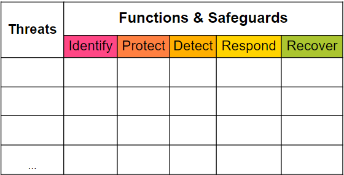

---

layout: col-sidebar
title: OWASP 脅威とセーフガードのマトリクス (Threat and Safeguard Matrix, TaSM)
tags: TaSM
level: 2
type: documentation

---
この著作物は <a rel="license" href="http://creativecommons.org/licenses/by-sa/4.0/">Creative Commons Attribution-ShareAlike 4.0 International License</a> の下でライセンスされています。

# はじめに
脅威とセーフガードのマトリクス (Threat and Safeguard Matrix, TaSM) は [CISO Tradecraft](https://www.cisotradecraft.com/) によって作成された、ビジネスを保護し実現するための行動指向のビューです。簡単に言うと、サイバーが収益保護のビジネスに携わっているのであれば、私たちは企業に対する最大の脅威に対抗するための多層防御計画を立てる必要があります。このマトリクスによって、企業は主要な脅威を NIST のサイバーセキュリティ機能 (Cyber Security Functions) (識別 (Identify), 防御 (Protect), 検知 (Detect), 対応 (Respond), 復旧 (Recover)) と重ね合わせて、堅牢なセキュリティ計画を構築できます。この活動を行う組織は重要な脅威を軽減するセーフガードを記入することで自社を保護する方法をよりよく理解できるようになります。悪魔 (devil) は細部に宿るということで、私たちはタスマニアデビル (TaSManian Devil) をプロジェクトのロゴに選びました。

例: 情報セキュリティ業界全体を見渡すと、企業に対する最大のデータ侵害にはフィッシング、ランサムウェア、ウェブアプリケーション攻撃、ベンダーやパートナーによるデータ損失が多いことに気づくでしょう。このマトリクスにはインサイダー脅威、サプライチェーン攻撃など、あなたの環境に特有のものを追加できることをご承知ください。

ここでは企業に対するこれらの脅威を軽減するための多層防御計画を構築する方法の一つを紹介します。

# 計画に評価指標 (Metrics) を加える
TaSM を構築したところで、リストアップしたセーフガードに目を向けることが重要です。すべてのセーフガードが重要というわけではありません。すべてが重要であるならば、真に重要なものは何もありません。組織として重視したいセーフガードについて考えてみてください。これらは脅威を阻止するために最も効果的なものである可能性があります。また、これらのセーフガードには最も改善の余地がある可能性もあります。重要な評価指標を設定できるセーフガードをいくつか選び、赤枠で囲んで強調します。こうすることで評価指標から TaSM への進行状況をマッピングできます。測定されたものが実行され、実行されたものが資金を得る (What gets measured gets done and what gets done gets funded) ことを忘れないでください。

# サイバーレポートカードを作成する
改善したいセーフガードの概略を記載した後、組織は主要な評価指標とスコアカードを作成する必要があります。この例ではいくつか注意すべき点がありますが、自由に変更してください。1) 物事をテクノロジ、人、プロセス、攻撃環境など主要なカテゴリにグループ化する。これらは測定可能な戦術的評価指標に分解されたグループです。これらの評価指標の測定方法を明確に定義することで、三種類の重要な情報を記録できます。2) 現在や過去の四半期における組織の <b>状況 (STATUS)</b>、改善されているかどうかを確認するための <b>傾向 (TRENDS)</b>、完了したかを確認するための期待される <b>目標 (GOALS)</b> です。(オプション) 目標にはいつまでに達成するかという期日を書いてもよいでしょう。

最後にスコアカードを使って、経営陣と共有できるストーリーを作りましょう。このストーリーは架空のものであり、実際の企業を反映したものではないことをご理解ください。

<b>例:</b> このスコアカードは XYZ 組織のリスクプロファイルを識別しました。ご覧の通り、99% のサーバーが 20 日以内に重大な脆弱性にパッチを適用していることがわかります。これらの脆弱性の数値は私たちが期待する 15 日間という目標には達していませんが、ウェブアプリケーションファイアウォール、プロキシサーバー、アンチウィルスなどのツールも導入しており、これらのセーフガードはパッチをすぐに適用できない隙間時間に対してさらなる保護を提供します。現在、パッチ適用プログラムには満足していますが、これが最も不安定な評価指標の一つであることも認識しています。また、毎年行われるフェールオーバーでは、ソフトウェアチームのわずか 60% しか成功しませんでした。つまり、プライマリデータセンタでハリケーンによる停電などの大規模な災害が発生した場合、当社の SOX アプリケーションの 40% が利用できないことになります。この評価指標を改善するために XYZ アクションを実行します。ご存じのように、私たちはランサムウェアの防御を非常に重視しています。そのため、重要なアプリケーションの 100% で復旧テストが成功したことを示すことができ、非常にうれしく思っています。これは、ランサムウェアの攻撃者が当社のサーバーを暗号化できたとしても、身代金を支払うことなく復旧できる自信があることを意味します。今後は XYZ に注力して ...

# TaSM を使用して脅威モデリングを強化する
組織で TaSM を適用する新たな方法を模索する中で、方法の一つとして脅威モデルの中でTaSM を活用できるかもしれません。例: 開発者チームは (暗号化層、アクセス制御方法、データタイプなどの) 主要な属性を示す [データフロー図](https://d1.awsstatic.com/whitepapers/compliance/pci-dss-compliance-on-aws.pdf?did=wp_card&trk=wp_card) と TaSM を組み合わせて使用することで、プロジェクト内の主要な問題を識別できます。アーキテクチャレビューボードでは、脅威モデルの議論において使用される多数の TaSM を確認して、アーキテクトはエンタープライズソリューションを必要とする共通の脅威やセーフガードを識別できるかもしれません。

# TaSM を使用してリスク委員会の改善に役立てる
脅威の種類はサイバー脅威だけではないため、TaSM をより広く使用するためにどのように採用できるかについてもリスク委員会で検討する必要があります。必要なのは企業内の組織をリストアップする列を追加することだけです。各組織が上位 3 ～ 5 の脅威を共有していると想像してみてください。リスク委員会は会社が最大の脅威をどのように軽減しているかを <b>一貫性があり (Consistent), 適切で (Adequate), 合理的で (Reasonable), 効果的な (Effective) (CARE)</b> 方法で示すことができます。さらに、委員会がパートナーと協力して、さまざまな角度から脅威を解決できます。例: ブランドに損害を引き起こすフィッシング攻撃への対応を支援するには、サイバー (Cyber) は人事 (HR) や法務 (Legal) のプロセスをどのように活用できるでしょうか。

# 用語の意味は？
TaSM を適切に使用するには、マトリクス内で使用されている用語の定義を必ず理解してください。

### 脅威 (Threats)
CNSS では組織の運営に悪影響を及ぼす可能性のあるあらゆる事象を **脅威 (Threat)** と定義しています。
一般的な脅威の種類はこちら [STRIDE-LM](assets/images/StrideLM.png "STRIDE-LM") の例をご覧ください。

### NIST 機能 (Functions)
NIST サイバーセキュリティフレームワークの 5 つの機能 (Functions) により、どのようにビジネスを保護するかを識別する多層防御戦略を作成できます。

**1) 識別 (Identify)**
識別機能はシステム、人、資産、データ、機能に対するリスク管理の組織的理解を深めるのに役立ちます。主な目的: この種の脅威に脆弱なすべての人、プロセス、システムを識別する。

**2) 防御 (Protect)**
保護機能は脅威の影響を制限したり、封じ込めたりする機能をサポートします。主な目的: 脆弱性を除去またはブロックすることで、どのように攻撃の脅威を制限できるか。

**3) 検知 (Detect)**
検知機能は事象の発生を適時に識別するための活動を定義するものです。主な目的: (防御フェーズで) 脅威を止めることができなかった場合に、それが発生していることおよび会社に被害が及んでいることをどのようにして知ることができるか。

**4) 対応 (Respond)**
対応機能には影響を最小限に抑えるためのインシデントに関する適切な活動があります。主な目的: 脅威が顕在化した際に、さらなる金銭的被害、風評被害、コンプライアンス違反、プライバシー侵害をどのように防止するか。

**5) 復旧 (Recover)**
復旧機能には耐性のための計画を維持し、サイバーセキュリティインシデントの際に障害のあるサービスを復帰させるための適切な活動を識別することがあります。主な目標: インシデント発生前と同等またはそれ以上の状態にどのようにして到達するか

### セーフガード (Safeguards)
**セーフガード (Safeguards)** とは情報システムの脆弱性を軽減する行動、装置、手順、技法、またはその他の手段です。セキュリティ管理や対策と同義です。これらのリストは出発点として自由にお使いください。
#### [153 CIS Controls V8 Implementation Group](https://learn.cisecurity.org/CIS_Controls_v8_Implementation_Groups_Handout)
#### [108 Safeguards outlined by NIST CSF](https://github.com/OWASP/www-project-threat-and-safeguard-matrix/blob/main/Nist_CSF_Safeguards) 
#### [42 Mitre Enterprise Mitigations](https://attack.mitre.org/mitigations/enterprise/)

# 謝辞
脅威とセーフガードのマトリクスのひらめきと改善にご協力いただいた多くの方々に感謝します。
#### [Cyber Defense Matrix](https://owasp.org/www-project-cyber-defense-matrix/) by [Sounil Yu](https://www.linkedin.com/in/sounil/)
#### [Cyber Controls Matrix](https://owasp.org/www-project-cyber-controls-matrix/) by [Eric Bragger](https://www.linkedin.com/in/eric-bragger/)
#### [Andy Ellis](https://www.linkedin.com/in/csoandy/)
#### [G Mark Hardy](https://www.linkedin.com/in/gmarkhardy/)
